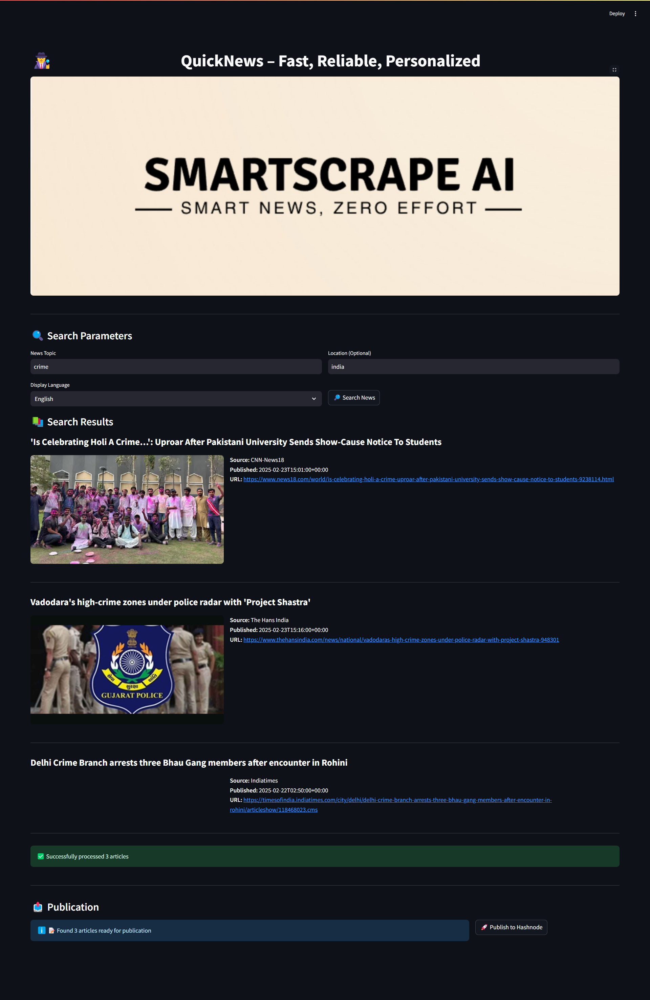
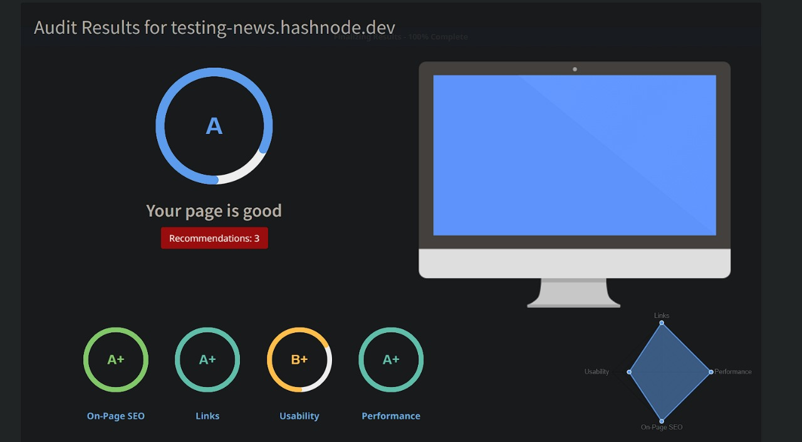

# SmartScrapAI - Autonomous AI News Agent 🤖📰

This project is an end-to-end news aggregation and summarization tool built with Streamlit that crawls webpages to collect and process news articles. Users input a news topic, location, and preferred language through an intuitive interface, triggering a workflow where the application searches for relevant news via DuckDuckGo and then crawls the identified webpages using the Newspaper library to extract full article content. The retrieved text is then tokenized and summarized with the "facebook/bart-large-cnn" transformer model, with optional translation applied via GoogleTranslator. Finally, the processed articles—complete with original and AI-generated images—are compiled into a cohesive news roundup that can be directly published to Hashnode.

## Hackathon Project

This project was developed as part of the FLIPR Hackathon 2025 by our team:

### Team Members
- Abhijeet
- Suryansh
- Gaurav
- Prateek

### Our Team


### Verification
Our participation in the FLIPR Hackathon 2025 can be verified through the official LinkedIn post by FLIPR, which includes our team photo and project details. 

[View Participation Post](https://www.linkedin.com/posts/fliprlabsindia_teamstrawhats-fliprhackathon25-iitdmkurnool-activity-7299704107253043200-F7py?utm_source=share&utm_medium=member_desktop&rcm=ACoAAD3G-lEBWcKgizxoZsx-q9X-yvXRi51-ync)

We're proud to have created this autonomous news aggregation system as our submission for the hackathon, combining web scraping, natural language processing, and publishing automation into a single streamlined application.



## Published news site excellent SEO test proof

## view our published news - [link](https://testing-news.hashnode.dev/news-roundup-crime-in-lucknow)

## go and check the model [link](https://huggingface.co/spaces/prateek145/news)
## Note - It is free deployed so you need to wait little more or - better you can run it on your personal pc
# Proof
[View PDF](./assets/published_news.pdf)

## 🎯 Project Overview

QuickNews tackles the challenge of automated news aggregation and publishing through:
- Web crawling and data extraction from reliable news sources
- Intelligent content summarization and structuring
- SEO optimization for better discoverability
- Automated publishing to Hashnode
- Support for multiple languages
- AI-generated imagery for enhanced visual appeal

## 🛠️ Technical Approach

### Data Collection & Processing
- Utilizes DuckDuckGo API for fetching recent news articles
- Implements the `newspaper3k` library for article extraction and parsing
- Uses NLTK for natural language processing and text summarization

### Content Generation
- Employs extractive summarization techniques to maintain factual accuracy
- Generates SEO-optimized titles and descriptions
- Creates AI-generated illustrations using Pollinations.ai

### Publishing Pipeline
- Automatically formats content in Markdown
- Handles image processing and optimization
- Publishes directly to Hashnode using their GraphQL API
- Supports multiple languages through Google Translate integration

## ✨ Features

- 🌐 **Multi-source News Aggregation**: Fetches news from various reliable sources
- 📝 **Smart Summarization**: Creates concise, readable summaries while maintaining context
- 🎨 **AI Image Generation**: Enhances articles with relevant AI-generated illustrations
- 🌍 **Multilingual Support**: Supports 10+ languages including Hindi, Tamil, Bengali
- 📊 **Clean UI**: Built with Streamlit for a seamless user experience
- 🚀 **One-Click Publishing**: Direct integration with Hashnode for automated publishing

## 🔧 Setup & Installation

1. Clone the repository:
```bash
git clone https://github.com/yourusername/quicknews.git
cd quicknews
```

2. Install dependencies:
prefered python version is 3.12.9
```bash
pip install -r requirements.txt
```

3. Configure API tokens:
   - Open `Final_name.py`
   - Update the following values:
```python
self.api_token = "Your_hashnode_api"       
self.publication_id = "Publication_id"
```

4. Update image path in `Final_name.py`:
```python
st.image("/path/to/your/image-title.jpg", use_container_width=True)
```

5. Run the application:
```bash
streamlit run main.py
```

## 🎮 Usage

1. Launch the application using the command above
2. Enter your search topic in the "News Topic" field
3. (Optional) Specify a location for location-specific news
4. Select your preferred display language
5. Click "Search News" to fetch and process articles
6. Review the generated summaries
7. Click "Publish to Hashnode" to publish the compiled article

## 🔑 Required API Keys

- Hashnode API Token (for publishing)
- Hashnode Publication ID (for article destination)

## 🤝 Contributing

Feel free to fork the repository and submit pull requests. For major changes, please open an issue first to discuss the proposed changes.


## 🎓 Acknowledgments

- Built for Flipr Hackathon 25
- Uses the excellent [newspaper3k](https://newspaper.readthedocs.io/) python library
- Powered by [Streamlit](https://streamlit.io/) for the UI
- Special thanks to [Hashnode](https://hashnode.com/) for their GraphQL API

## 📞 Contact

For any queries regarding the project, feel free to reach out:
- Email: verma.job.145pratee@gmail.com
- LinkedIn: [prateek](https://www.linkedin.com/in/prateek-verma-2a202b287)

